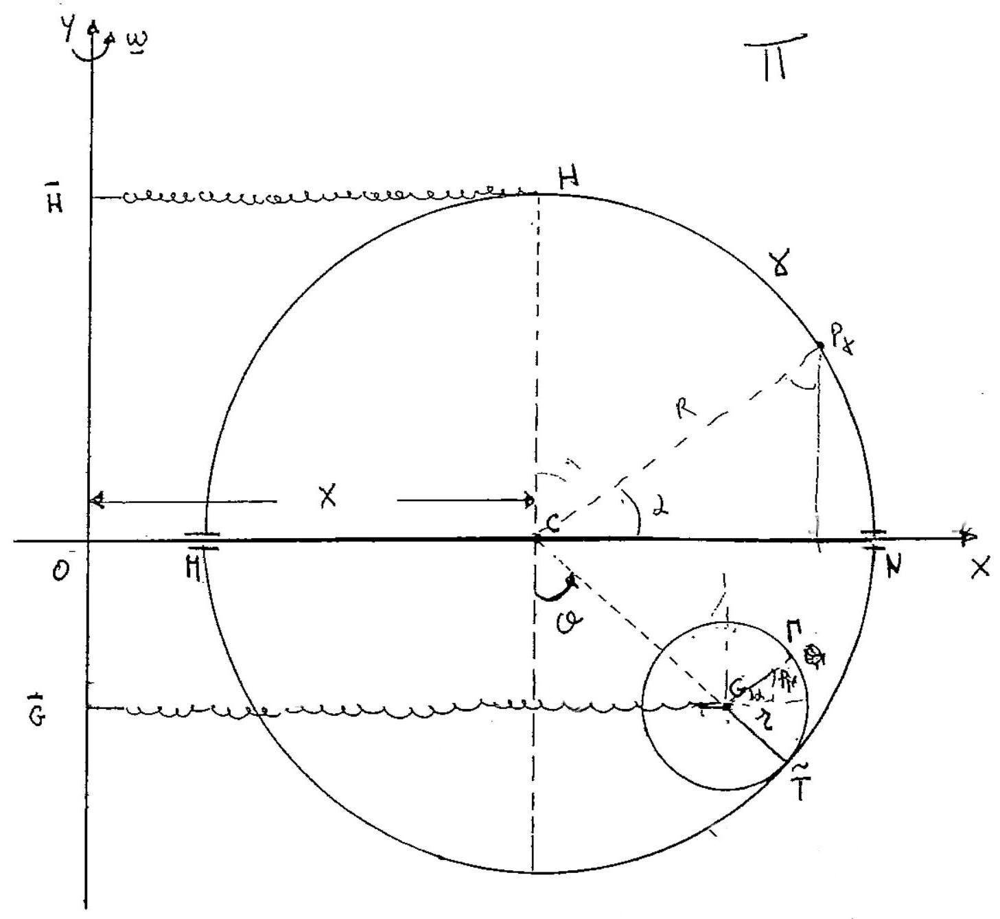

>Università degli studi di Catania  Corso di laurea in Fisica  Meccanica Analitica  Appello del 27.06.2014

---

Un sistema materiale é costituito da un disco omogeneo $\Gamma$ di massa
$M$ centro $G$ e raggio $r$ e da una circonferenza omogenea $\gamma$ di
centro $C$ e raggio $R=r+d$ avente la stessa massa $M$. Il sistema é
vincolato a stare su un piano verticale II liscio, nel quale si é
introdotto un sistema di riferimento ortogonale $\{0, x, y\}$ con l'asse
$y$ verticale ascendente, ed é soggettonax seguenti vincoli: un diametro
$M N$ di $\gamma$ scorre senza attrito sull'asse delle $x$,mentre
$\dot{\Gamma} \cdot$ rótola internamente su $\gamma$, senza strisciare.

Sul sistema, oltre alla forza peso $M \mathrm{~g}$ agiscóno le vltertori
forze

$$\left\{F_{1}=-4 M \frac{g}{d}(G-\bar{G}), G\right\} \quad\left\{F_{2}^{3}=-2 M \frac{g}{d}(H-\bar{H}), H\right\}$$

essendo $\bar{G}$ la proiezione ortogonale di $G$ sull'asse $y, H$ il
punto della circonferenza $\gamma$ di massima quota, mentre $\bar{H}$ é
la proiezione ortogonale di $H$ sull'asse $y$. Inoltre il piano II é
posto in rotazione uniforme attorno alll'asse $y$ con velocitá angolare
$\omega=\sqrt{\alpha g / d}$ essendo $\alpha$ una costante reale con la
condizione che $2<\alpha<3$ ed $\alpha \neq 4-\sqrt{2}$. Si chiede di:

1.  Determinare le configurazioni di equilibrio del sistema, studiando
    in particolare la stabilitá della evidente configurazione di
    equilibrio $S_{1}$, in cui $C$ e $G$ hanno coordinate
    rispettivamente $C=(0,0)$ e $G=(0,-d)$.

2.  Determinare le equazioni di moto e gli eventuali integrali primi.

3.  Studiare i moti linearizzati attorno alla configurazione di
    equilibrio $S_{1}$ confrontando i risultati ottenuti con la
    stabilitá di $S_{1}$

??? note "Visualizza lo svolgimento"
    

---

[:fontawesome-regular-file-pdf: Download](pdf/2014-2016-t.pdf){ .md-button }