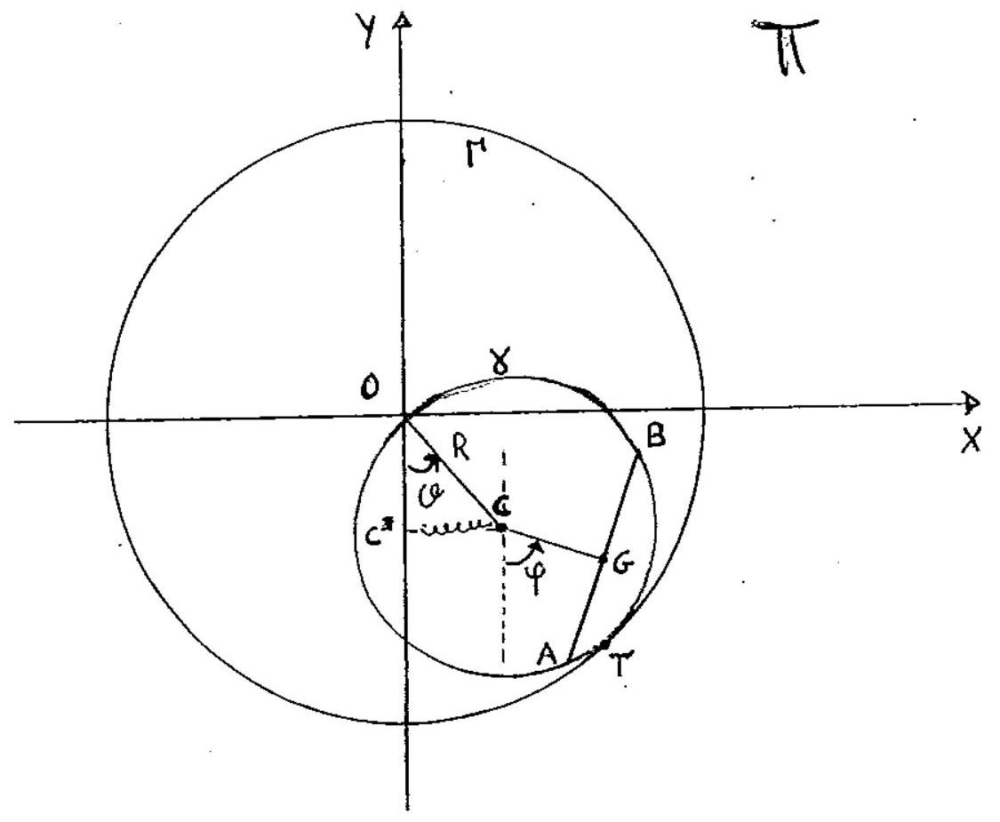

> Università degli studi di Catania  Corso di laurea in Fisica  Meccanica Analitica  Appello del 11.06.2014

---

Uń sistema materiale, posto su un piano verticale $\Pi$, é costituito da
un disco omogeneo $\gamma$ di massa $M$ e raggio $R$ e da un'asta
omogenea $A B$ di massa $2 M$ e lunghezza $\sqrt{3} R$. Il sistema é
soggetto ai seguenti vincoli: $\gamma$ é vincolata a rotolare senza
strisciare all'interno di una circonferenza fissa $\Gamma$ di raggio
$2 R$; l'asta $A B$ ha i suoi estremi $A$ e $B$ vincolati a scorrere
senza attrito sul bordo di $\gamma$.

Nell'ipotesi in cui, oltre alla forza peso, agisca la forza
$F=-k\left(C-C^{*}\right)$ applicata nel centro $C$ di $\gamma$, dove
$C^{*}$ é la proiezione ortogonale di $C$ sulla retta fissa verticale
passante per il centro $O$ di $\Gamma$ e supponendo che $k>0$ con
$\frac{3 M g}{k R} \neq 1$, si chiede di:

1.  Determinare le configurazioni di equilibrio del sistema, indagando
    la stabilitá delle suddette configurazioni.

2.  Determinare le equazioni di moto e gli eventuali integrali primi.

3.  Studiare i moti linearizzati attorno alla configurazione di
    equilibrio nella quale il sistẹma occupa la posizione piú bassa
    consentita dai vincoli.

$$q^{\alpha} \equiv\{\vartheta, \varphi\}$$

??? note "Visualizza lo svolgimento"
    

---

[:fontawesome-regular-file-pdf: Download](pdf/2014-2016-t.pdf){ .md-button }