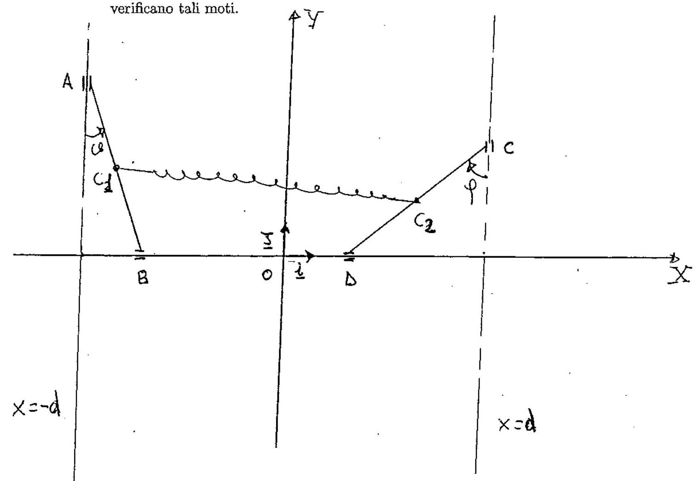

>Università degli studi di Catania  Corso di laurea in Fisica  Compito di Meccanica Analitica  Appello del 14.12.2015

---

Un sistema materiale mobile $S$, posto in un piano verticale, é
costituito da due aste omogenee $A B$ e $C D$, aventi la stessa massa
$m$ e la stessa lunghezza 2l. Introdotto un sistema di riferimento
cartesiano ortogonale $\{O, \mathbf{i}, \mathbf{j}\}$ (come in figura),
l'estremo $A$ di $A B$ é vincolato a muoversi su una guida verticale di
equazione $x=-d$, l'estremo $C$ di $C D$ é vincolato a muoversi su una
guida verticale di equazione $x=d$ (essendo $2 d$ la distanza tra le due
guide), mentre i secondi estremi $B$ e $D$ sono vincolati a muoversi su
una guida sovrapposta all'asse delle $X$. Supponendo che tutti i vincoli
siano realizzati senza attrito e che sul sistema $S$, oltre alla forza
peso, agiscano le forze

$$\left\{-\gamma\left(C_{1}-C_{2}\right), C_{1}\right\} \quad \text { e } \quad\left\{-\gamma\left(C_{2}-C_{1}\right), C_{2}\right\}$$

e le due forze costanti

$$\left\{-2 \gamma d i, C_{1}\right\} \quad \text { e } \quad\left\{2 \gamma d i, C_{2}\right\}$$

essendo $\gamma$ una costante positiva tale che
$\frac{m g}{2 \gamma l}>1$, e $C_{1}, C_{2}$ rispettivamente i
baricentri delle aste $A B \cdot \mathrm{e} C D$.

1.  Determinare le configurazioni di equilibrio del sistema $S$,
    analizzando la stabilitá delle suddette configurazioni.

2.  Determinare le equazioni di moto e gli eventuali iategrali primi.

3.  Studiare i moti linearizzati attorno alla configurazione di
    equilibrio nella quale le due aste occupano le posizioni piú basse.

4.  Determinare se esistono moti in cui le aste si mantengono parallele
    in ogni istante fra loro e, in caso affermativo, dare le condizioni
    iniziali per cui si verificano tali moti.

??? note "Visualizza lo svolgimento"
    

---

[:fontawesome-regular-file-pdf: Download](pdf/2014-2016-t.pdf){ .md-button }