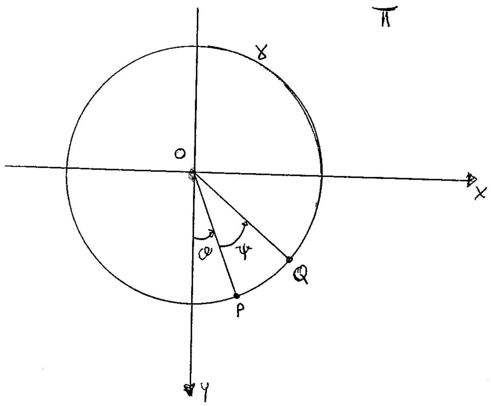

>Università degli studi di Catania  Corso di laurea in Fisica  Compito di Meccanica Analitica  Appello del 12.02.2016

---

Sia data una guida circolare $\gamma$ di centro $O$ e raggio $R$ posta
in un piano verticale II dove è stato introdotto un sistema di
riferimento cartesiano ortogonale $\{O, x, y\}$ con l'asse delle $y$
verticale discendente. Un sistema materiale $\mathrm{S}$ é costituito da
due punti $P$ e $Q$ aventi la stessa massa $m$, vincolati a muoversi
senza attrito su $\gamma$, ed é soggetto, oltre alla forza peso, alle
due forze di mutua repulsione

$$\{\mathrm{F}, P\} \quad \text { e } \quad\{-\mathrm{F}, Q\} \quad \text { con } \quad \mathbf{F}=4 \alpha m g R \frac{(P-Q)}{\mid P-Q\}^{2}}$$

essendo $\alpha$ una costante reale positiva.

Il sistema. ha ovviamente due gradi di libertá, scelte allora come
coordinate Lagrangiane gli angoli $\vartheta$ che $(P-O)$ forma con
l'asse delle $y$ e $\psi$ che $(Q-O)$ forma con $(P-O)$ ambedue misurati
in modo che le rotazioni di $P$ per $\vartheta$ crescente, e, per
fissato $P$, quella di $Q$ per $\psi$ crescente siano entrambe in senso
antiorario.

1.  Dimostrare che la sollecitazione agente su $S$ é conservativa e che
    per la coppia $\{\vartheta, \psi\}$ delle due variabili lagrangiane
    $0 \leq \vartheta \leq 2 \pi$ e $0<\psi<2 \pi$

2.  Determinare le configurazioni di equilibrio del sistema $S$,
    studiando la stabilitá delle suddette configurazioni.

3.  Determinare le equazioni di moto e gli eventuali integrali primi.

4.  Studiare i moti linearizzati, determinando la frequenza dei piccoli
    moti, attorno ad una configurazione di equilibrio stabile.

??? note "Visualizza lo svolgimento"
    
    Non ancora disponibile. Se sei in possesso dello svolgimento, valuta la possibilità di contribuire al progetto facendo click sull'icona di modifica in alto a destra

---

[:fontawesome-regular-file-pdf: Download](pdf/2014-2016-t.pdf){ .md-button }