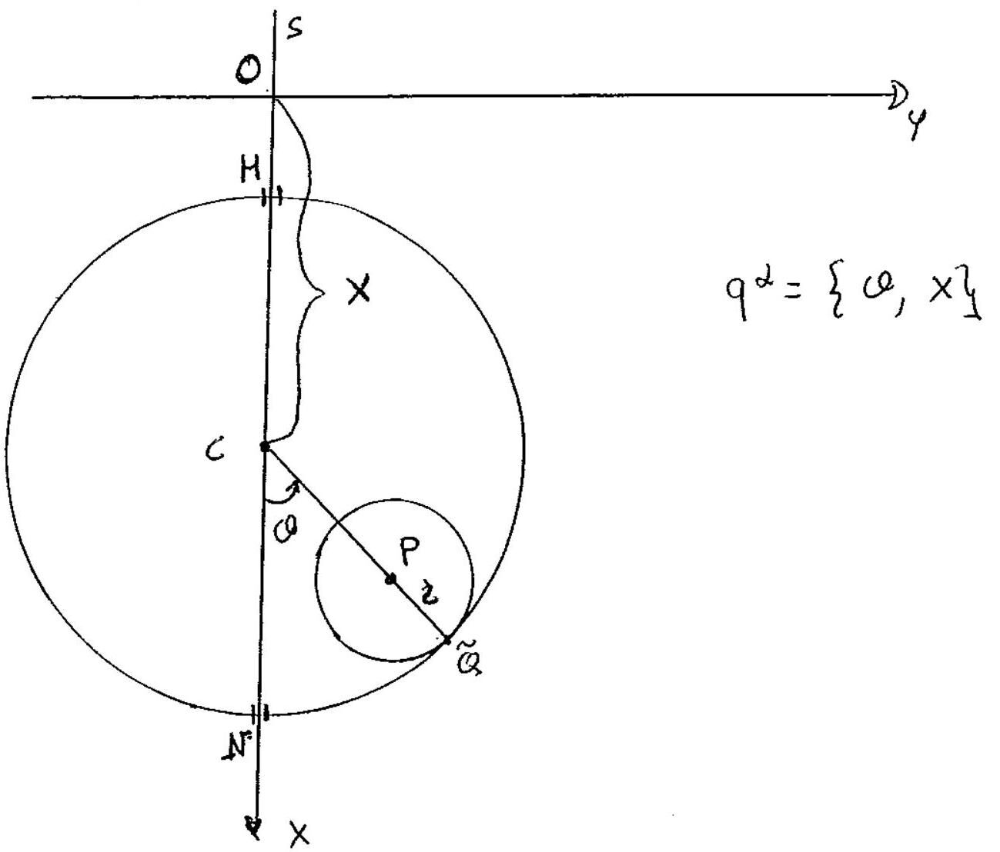

>Università degli studi di Catania  Corso di laurea in Fisica  Meccanica Analitica  Appello del 04.03.2016

---

Su nu piano verticale $\Pi$ liscio é vincolato a stare, durante tutto il
suo moto, un sistema materiale $S$ costituito da un disco omogeneo
$\Gamma$ di massa $m$, centro $P$ e raggio $r$ e da una circonferenza
omogenea $\gamma$ di massa $m$, centro $C$ e raggio $d=r+R$, avente due
punti $M$ ed $N$, diametralmente opposti, vincolati a muoversi su una
verticale $s$ di $\Pi$.

Introdotto un sistema di riferimento ortogonale $\{O, x, y\}$ con l'asse
$x$ verticale discendente coincidente con la retta $s$ in modo che
diametro $M N$ di $\gamma$ scorre senza attrito sull'asse delle $x$,
mentre $\Gamma$ rotola internamente su $\gamma$, senza strisciare. Sul
sistema, oltre alle forze peso agisce l'ulteriore forza

$$\left\{F=-\alpha \frac{m g}{R}(P \rightarrow O), P\right\}$$

essendo $O$ un punto fisso di $s$ coincidente con l'origine del nostro
riferimento, ed $\alpha$ un numero reale positivo con $\alpha \neq 1$.

Si chiede di:

1.  Determinare le configurazioni di equilibrio del sistema, e
    studiarne, ove possibile, la stabilitá al variare del parametro
    $\alpha$.

2.  Determinare le equazioni di moto di $S$ e gli eventuali integrali
    primi.

3.  Studiare i moti linearizzati attorno alla configurazione di
    equilibrio in cui $P$ sta su $s$ al di sotto di $C$.

U

??? note "Visualizza lo svolgimento"
    

---

[:fontawesome-regular-file-pdf: Download](pdf/2014-2016-t.pdf){ .md-button }