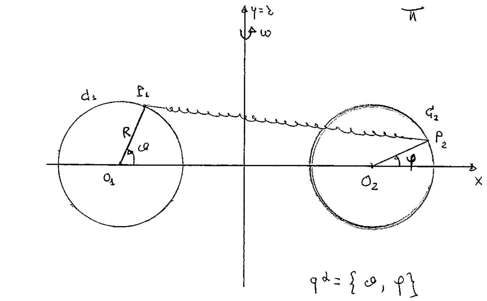

>Università degli studi di Catania  Corso di laurea Triennale in Fisica  Prova in itinere per il corso di Meccanica Analitica  Appello del 29.04.2016

---

In un piano verticale II è posto un sistema materiale è costituito da
due punti $P_{1}$ e $P_{2}$ di uguale massa $m$, vincolati a muoversi
rispettivamente su due circonferenze $C_{1}$ e $C_{2}$ di uguale raggio
$R$, con i centri $O_{1}$ ed $O_{2}$ posti a distanza $4 R$. Sui due
punti $P_{1}$ e $P_{2}$ agiscono le forze

$$\left\{F_{1}=-k\left(P_{1}-P_{2}\right), P_{1}\right\}, \quad\left\{F_{2}=-k\left(P_{2}-P_{1}\right), P_{2}\right\}$$

dove $k>0 . \Pi$ piano $\Pi$ é posto in rotazione uniforme, con velocitá
angolare $\omega$, attorno alla retta $\mathrm{r}$ di $\Pi$
perpendicolare, al segmento $\bar{O}_{1} O_{2}$, nel punto medio tra
$O_{1}$ ed $O_{2}$. Tutti i vincoli sono realizzati senza attrito. Si
chiede di:

1.  Verificare che sono configurazioni di equilibrio per il sistema le 4
    configurazioni per le quali $P_{1}$ e $P_{2}$ sono allineati con
    $O_{1}$ ed $O_{2}$ e studiare la stabilitá della configurazione
    $S_{1}$ in cui i punti $P_{1}$ e $P_{2}$ hanno distanza minima.

2.  Determinare le condizioni sui parametri $\omega$ e $k$ affinché
    siano configurazioni di equilibrio quelle per cui i vettori
    $P_{1}-O_{1}$ e $P_{2}-O_{2}$ siano ortogonali ad $O_{1}-O_{2}$

Nelle condizioni di cui al punto 2.

-   Scrivere le equazioni di moto del sistema e gli eventuali integrali
    primi.

-   Studiare le equazioni in prima approssimazione attorno alla
    configurazione di equilibrio $S_{1}$.

-   Verificare se esistono moti per $i$ quali i vettori $P_{1}-O_{1}$ e
    $P_{2}-O_{2}$ si mantengono paralleli, ed in tali condizioni dire di
    che moto si tratta.

??? note "Visualizza lo svolgimento"
    
    Non ancora disponibile. Se sei in possesso dello svolgimento, valuta la possibilità di contribuire al progetto facendo click sull'icona di modifica in alto a destra

---

[:fontawesome-regular-file-pdf: Download](pdf/2014-2016-t.pdf){ .md-button }