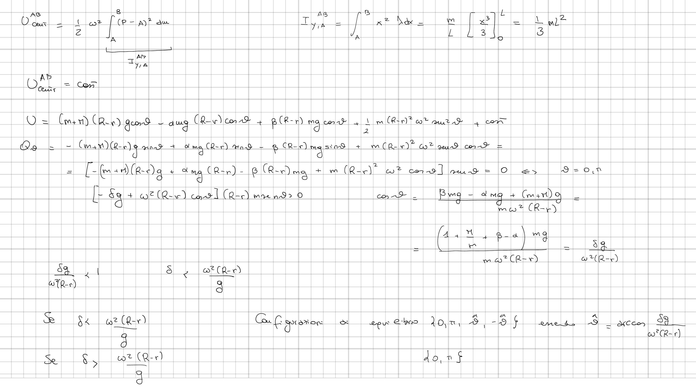

>Università degli studi di Catania   Corso di laurea triennale in Fisica  
Esame di Meccanica Analitica 

---

Un sistema materiale, posto in un piano verticale $\Pi$, é costituito da
una sbarra rigida omogenea pesante $A B$ di massa $M$ e da un disco
omogeneo pesante $\Gamma$ di massa $m$, centro $C$ e raggio $r$. Il
disco $\Gamma$ é vincolato a rotolare senza strisciare lungo il bordo
interno di una guida circolare fissa $\gamma$ di raggio $R>r$ e centro
$O$ posta in $\Pi$. Considerando il riferimento cartesiano ortogonale
$\{O, \vec{x}, \vec{y}\}$, come in figura, l'asta $A B$, di lunghezza
$L>R$, si muove lungo la direzione verticale $y$ con l'estremo $A$
sull'asse $O y$, mantenendosi ortogonale a questo asse e passando per il
centro $C$ del disco $\Gamma$. Sul sistema, oltre alla forza peso,
agiscono le seguenti forze

$$\left\{F_{1}=-k(C-Q), C\right\} \quad\left\{F_{2}=-\beta m g \vec{e}_{2}, A\right\} \quad \operatorname{con} \quad k, \beta>0$$

essendo $Q$ il punto di intersezione del circolo $\gamma$ con l'asse
delle $y$ positiva, ed $\vec{e}_{2}$ il versore dell'asse $y$.

Il piano II é posto in rotazione uniforme con velocitá angolare
$\underline{w}$ attorno alla verticale $y$ di $\Pi$ e tutti i vincoli
sono realizzati senza attrito.

Nella ipotesi che la costante elastica $k=\alpha m g / R$ con
$\beta>\alpha>0$ e scegliendo come coordinata lagrangiana l'angolo
$\vartheta$ che la direzione di $\overrightarrow{O C}$ forma con la
verticale discendente (vedi figura), si chiede di determinare nel
riferimento relativo:

1.  Le configurazioni di equilibrio del sistema, studiandone la
    stabilitá.

2.  Scrivere le equazioni di moto, determinando gli eventuali integrali
    primi.

3.  Studiare i moti in prima approssimazione attorno alle configurazioni
    di equilibrio per il sistema.

!!! warning

    I contenuti pubblicati rappresentano dei test e non si assicura la correttezza delle soluzioni riportate.

??? note "Visualizza lo svolgimento"
    
    $$\begin{aligned}
    & Q=(0, R) \quad \tilde{P}=(R \sin \theta,-R \operatorname{con} \omega) \\
    & A=(0,-(R-r) \cos \theta) \\
    & B=(L,-(R-r) \cos \theta) \\
    & C=((R-r) \operatorname{sen} \theta,-(R-r) \cos \theta) \\
    & \left.F_{1}=-k((R-r) \sin \theta)-R \cos \theta+r \cos \theta-R\right) \quad x \\
    & F_{2}=-\beta m g(0,1)
    \end{aligned}$$

    

    $$\begin{aligned}
    & d F^{c a \bar{~}}=\omega^{2}(P-\bar{P}) \text { dur su ciascun porio } P \text { del siñema } \\
    & U_{p}^{\Pi}+U_{p}^{A B}=m g(0,-1) \cdot(c-0)+M g(0,-1) \cdot(G-0)=m g(R-r) \cos \theta+M 0(R-r) \cos \theta=(m+M)(R-r) g \cos \theta \\
    & U_{1}=-\frac{1}{2} k(C-Q)^{2}=-\frac{1}{2} k((R-r) \operatorname{sen} \theta,-(R-r) \cos \theta-R)^{2}=-\frac{1}{2} k\left[(R-r)^{2} \operatorname{sen}^{2} \theta+(R-r)^{2} \cos 2 \theta+2 R(R-r) \cos \theta+R{ }^{2}\right]= \\
    & =-\alpha \operatorname{cog}(R-r) \cos \theta+\cos \\
    & U_{2}=-\beta \operatorname{mg}(0,1) \cdot(A-0)=\beta(R-r) m g \cos \theta \\
    & U_{\operatorname{cen}}^{\pi}=\frac{1}{2} \omega^{2} \int_{\Gamma}(p-\bar{p})^{2} d u=\frac{1}{2} I_{y, 0}^{\Gamma} \omega^{2}= \\
    & I_{y, 0}=m(C-A)^{2}+\underset{\downarrow}{I_{y, C}^{\Gamma}} \\
    & =\frac{1}{2} m(C-A)^{2} \omega^{2}+\cos -= \\
    & =\frac{1}{2} m(R-r)^{2} \omega^{2} \operatorname{sen}^{2} \theta
    \end{aligned}$$

    

    $$\begin{aligned}
    & U_{\theta \theta \theta}=-(m+r)(R-r) g \cos \theta+\alpha m g(R-r) \cos \theta-\beta(R-r) m g \cos \theta+m(R-r)^{2} \omega^{2} \cos 2 \theta \\
    & U_{0,}(0)=-(m+M)(R-r) g+\alpha m g(R-r)-\beta(R-r) m g+m(R-r)^{2} \omega^{2}= \\
    & =(R-r) m\left[\left(-1-\frac{M}{m}+\alpha-\beta\right) g+(R-r) \omega^{2}\right]=(R-r) m\left[(R-r) \omega^{2}-\delta g\right]>0 \\
    & \omega^{2}(R-r)-\delta_{0}^{\pi}>0 \\
    & \omega^{2}(R-r)>\delta g
    \end{aligned}$$

    $\vartheta=0$ rtab.le $x \frac{\delta g}{\omega^{2}(R-r)}>1$, iustabile
    se $\frac{\delta g}{\omega^{2}(R-r)}<1$

    Se $\frac{\delta g}{\omega^{2}(R-r)}=1$

    $$\begin{aligned}
    & {\left[-\delta g+\omega^{2}(R-r) \cos \theta\right](R-r) m \ln \theta>0 \quad[-1+\cos \theta] \omega^{2}(R-r)^{2} m \operatorname{sen} \theta>0<><\varepsilon<2 \pi} \\
    & \vartheta=0 \text { i max del poiertiale } \Rightarrow \\
    & \Rightarrow \text { eqo eibrio rtabile }
    \end{aligned}$$

    $U_{00}(\pi)=(m+\pi)(R-r) g-\alpha m g(R-r)+\beta(R-r) m g+m(R-r)^{2} \omega^{2}>0 \Rightarrow \pi$
    e iusiabile

    Deito
    $\lambda=\frac{\delta g}{\omega^{2}(R-r)} \quad U_{\theta \theta}(\hat{\vartheta})=U_{v \theta}(-\hat{\vartheta})=m(R-r)^{2} \omega^{2}\left[-\lambda^{2}+2 \lambda^{2}-1\right]=$

    $=m(R-r)^{2} \omega^{2}\left[\lambda^{2}-1\right]<0 \quad$ percle
    $\lambda=\frac{\delta g}{\omega^{2}(R-r)}<1 \Rightarrow \hat{\vartheta} e-\hat{\vartheta}$
    stabie.

    Energe cinetice

    $$\begin{aligned}
    & T^{A B}=\frac{1}{2} M \dot{e}^{2}=\frac{1}{2} M(R-r)^{2} \operatorname{sen}^{2} \theta \dot{\theta}^{2} \\
    & T^{\Gamma}=\frac{1}{2} m \dot{C}^{2}+\frac{1}{2} I_{z, c}^{n} \Omega^{2}=\quad I_{z, c}=\iint \rho^{2} d u=\int \rho^{2} \sigma \rho d \rho d a= \\
    & =\frac{1}{2} m(R-r)^{2} \dot{\theta}^{2}+\frac{1}{4} m r^{2} \Omega^{2} \quad=\frac{m}{\pi r^{2}} \int_{0}^{r} \rho^{3} d \rho \int_{0}^{2 \pi} d \alpha= \\
    & V_{\hat{p}}=0=\dot{C}+\Omega x(\hat{p}-c) \quad=\frac{m}{\pi r^{2}} \frac{r^{4}}{4} \quad 2 \pi=\frac{1}{2} m r^{2} \\
    & \left|\begin{array}{ccc}
    \hat{\imath} & \hat{\jmath} & \hat{k} \\
    0 & 0 & \Omega \\
    \text { rame } & - \text { ran } \theta & 0
    \end{array}\right| \quad \tilde{P}=(R \sin \theta,-R \cos \theta) \\
    & (r \cos \theta \Omega, r \sin \theta \Omega, 0) \quad C=((R-r) \operatorname{sen} \theta,-(R-r) \cos \theta) \\
    & \dot{C}=((R-r) \cos \theta \dot{\theta},(R-r) \operatorname{mi\theta } \theta)=(r \cos \theta \Omega, r \sin \theta \Omega, 0) \quad \begin{array}{l}
    (R-r) \cos \theta \dot{\theta}=r \cos \theta \Omega \\
    (R-r) \min \theta=r \sin \Omega
    \end{array}
    \end{aligned}$$

    Euerpia ro canderva

    $$\begin{aligned}
    & T^{r}=\frac{1}{2} m(R-r)^{2} \dot{\theta}^{2}+\frac{1}{9} m(R-r)^{2} \dot{\theta}^{2}=\frac{3}{4} m(R-r)^{2} \dot{\theta}^{2} \\
    & T=\frac{1}{2} M(R-r)^{2} \operatorname{sen}^{2} \theta \dot{\theta}^{2}+\frac{3}{4} m(R-r)^{2} \dot{\theta}^{2} \\
    & \frac{\partial T}{\partial \dot{\theta}}=M(R-r)^{2} \operatorname{sen}^{2} \theta \dot{\theta}+\frac{3}{2} m(R-r)^{2} \dot{\theta} \\
    & \frac{d}{d t} \frac{\partial T}{\partial \theta}=M(R-r)^{2} m m^{2} \theta \ddot{\theta}+2 \pi(R-r)^{2} \operatorname{sen} \theta \cos \theta \dot{\theta}^{2}+\frac{3}{2} m(R-r)^{2} \theta \\
    & \frac{\partial T}{\partial \theta}=M(R-r)^{2} \operatorname{sen} \theta \cos \theta \dot{\theta}^{2}
    \end{aligned}$$\[

    \\left[\\frac{3}{2} m+\\pi \\operatorname{sen}\^{2}
    \\theta\\right](%5Cnot-r)\^{2} \\ddot{\\theta}+M(B-r)\^{2}
    \\operatorname{sen} \\theta \\cos \\theta \\theta\^{2}=\[-\\lambda+\\cos
    \\theta\] m \\omega^{2}(R-r)^{2} \\operatorname{sen} \\theta

    \]\[

    \\left\[\\frac{3}{2} m+\\pi \\operatorname{sen}\^{2} \\theta\\right\]
    \\ddot{\\theta}+\\pi \\operatorname{sen} \\theta \\cos \\theta
    \\dot{\\theta}\^{2}=m \\omega\^{2} \\sin \\theta(\\cos \\theta-\\lambda)
    \] Madi enearittati

    $$\frac{3}{2} m \ddot{\theta}=\left.Q_{\theta}\right|_{s}+\left.U_{-0}\right|_{s}\left(\theta-\theta_{s}\right)$$

    $S_{1} \quad \theta=0$

    $$\begin{aligned}
    & \frac{3}{2} m \dot{\theta}=m\left[\omega^{2}-\delta g\right] \theta=\quad m \omega^{2}[1-\lambda] \vartheta \\
    & \frac{3}{2} m t^{2}=m \omega^{2}(1-\lambda) \rightarrow \tau^{2}=2 \frac{\omega^{2}(1-\lambda)}{3}>0 \Leftrightarrow \lambda<1
    \end{aligned}$$

    $\lambda<1$ woti iperbolici $\lambda=1$ woti uniformi $\rightarrow$ non
    a sems $e_{a}$ $\lambda>1$ wesi arcwonici eluedriftatione

    $$\begin{aligned}
    S_{2} \quad \theta=\pi & \frac{3}{2} m \ddot{\theta}- \\
    & =m \quad \omega^{2}\left[\frac{\delta g}{\omega^{2}(R-r)^{2}}+1\right](\theta-\pi) \quad \text { Cerco rhmer } \quad \theta-\pi=\theta_{0} e e^{t}
    \end{aligned}$$

    $0<\lambda<1 \quad \tau^{2}=\frac{2}{3} \quad \omega^{2}\left(\frac{\delta g}{\omega^{2}(R-r)^{2}}+1\right) \rightarrow 0 \Rightarrow$
    mot iperbale.

    $S_{3} \quad \theta=\hat{\theta}$

    $$\frac{3}{2} m \ddot{\vartheta}=m \omega^{2}\left[\lambda^{2}-1\right](\theta-\hat{\vartheta}) \quad,-\hat{\vartheta}=\theta_{0} e^{\alpha t}$$

    $$\frac{3}{2} m \alpha^{2}=m \omega^{2}\left(\lambda^{2}-1\right)$$

    $$a^{2}=\frac{2}{3} \omega^{2}\left(\lambda^{2}-1\right)<0 \quad \Rightarrow \text { moti drmonici }$$

    Andogle conideradin valyow per $v=-\hat{\theta}$

---

[:fontawesome-regular-file-pdf: Download](pdf/2019-03-01-ts.pdf){ .md-button }