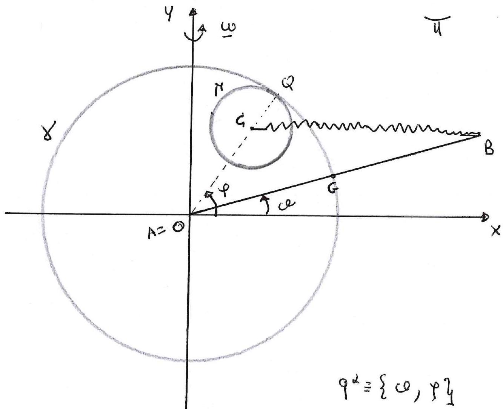

>Università degli studi di Catania  Corso di laurea triennale in Fisica  Esame di Meccanica Analitica  Appello del 17.07.2020

---

Un sistema materiale, appartenente ad un piano verticale $\pi$, sia
costituito da una disco $\Gamma$ omogeneo di massa $m$ e raggio
$r=R / 4$ e centro $C$, vincolato a muoversi rotolando senza strisciare
internamente ad una guida circolare fissata $\gamma$ di centro $O$ e
raggio $R$ (essendo $Q$ il punto di contatto tra il disco $\Gamma$ e
l'anello $\gamma$ ), e da una barra $A B$ omogenea di massa
$M(M \neq m)$ e lunghezza $L=2 R$ avente il suo estremo $A$ fissato,
coincidente con il centro $O$ di $\gamma$, e potendo quindi ruotare
attorno ad esso. Sul sistema, agiscono soltanto le forze

$$\{F, C\} \quad\{-F, B\} \quad \text { essendo } F=-k(C-B) \quad \text { con } \quad k>0 \text {. }$$

Posto $O$ come origine del riferimento $\{O, \vec{x}, \vec{y}\}$ (vedi
figm'a), ed il piano $\pi$ in rotazione uniforme, con velocitá angolare
$\omega$, attorno all'asse $\vec{y}$, si suppone che tutti i vincoli
associati all'asta siano senza attrito, ed si individuano come possibili
coordinate lagrangiane i due angoli, $\vartheta$ che l'asta $A B$ forma
con l'asse $\vec{x}$ e $\varphi$ che il raggio $O Q$ forma con l'asse
$\vec{x}$ (vedi figura).

Si chiede di determinare nel riferimento relativo:

1.  Tutte le possibili (ed evidenti) configurazioni di equilibrio del
    sistema assumendo che $\sin (\varphi-\theta)=0$.

2.  studiare la stahilitá ed instabilitá delle sole configurazioni
    ottenute per $\varphi=\theta$, assumendo per semplicitá che
    $m=64 / 27 M$ e $k \neq 4 / 9 M \omega^{2}$.

3.  Le equazioni di moto e gli eventuali integrali primi.

4.  Studiare i moti linearizzati (con la condizione $m=64 / 27 M$ ), del
    sistema descritto, attorno alle evidenti configurazioni di
    equilibrio $\{0,0\}$ ed $\{\pi, \pi\}$.

---

??? note "Visualizza lo svolgimento"
    

---

[:fontawesome-regular-file-pdf: Download](pdf/2020-07-17.pdf){ .md-button }