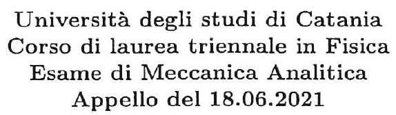

>Università degli studi di Catania  Corso di laurea triennale in Fisica  Esame di Meccanica Analitica  Appello del 26.02.2021

---

Un sistema materiale, posto in un piano verticale $\Pi$, é costituito da
due aste rigide omogenee pesanti $A B$ ed $C D$ di lunghezza $2 R$ e
massa $m$ e da un disco omogeneo $\Gamma$ di centro $G$, raggio $R$ e
massa $M=m / 3$. Il sistema è soggetto ai seguenti vincoli: L'estremo
$A$ di $A B$ è fisso in un punto $O$ di $\Pi$, gli estremi $B$ e $C$
delle due aste sono incernierati tra loro, mentre l'estremo $D$ della
seconda asta é incernierato nel centro $G$ del disco $\Gamma$, il quale
a sua volta é vincolato a rotolare senza strisciare su una guida
orizzontale $s$ posta inferiormente ad $O$ a distanza $R$ da esso (vedi
figura).

Oltre alla forza peso, sul sistema agisca la forza elastica

$$\{F=-k(D-O), D\} \quad \text { con } \quad k>0 .$$

Inoltre supponendo che, il piano II é posto in rotazione uniforme, con
velocitá angolare $\omega=\sqrt{2 k / m}$, attorno alla verticale (asse
$y$ in figura) passante per $O$, che tutti i vincoli siano realizzati
senza attrito, e considerando come variabile lagrangiana l'angolo
$\vartheta$ che l'asta $A B$ forma con l'asse orizzontale $x$ (vedi
figura), si chiede di determinare nel riferimento relativo:

1.  Le configurazioni di equilibrio del sistema, studiandone la
    stabilitá al variare di $k$.

2.  Scrivere l'equazione di moto, determinando gli eventuali integrali
    primi.

3.  Studiare i moti in prima approssimazione attorno alle possibili
    configurazioni di equilibrio del sistema.

---

??? note "Visualizza lo svolgimento"
    

---

[:fontawesome-regular-file-pdf: Download](pdf/#.pdf){ .md-button }

---

??? note "Visualizza lo svolgimento"
    

---

[:fontawesome-regular-file-pdf: Download](pdf/2021-02-26.pdf){ .md-button }