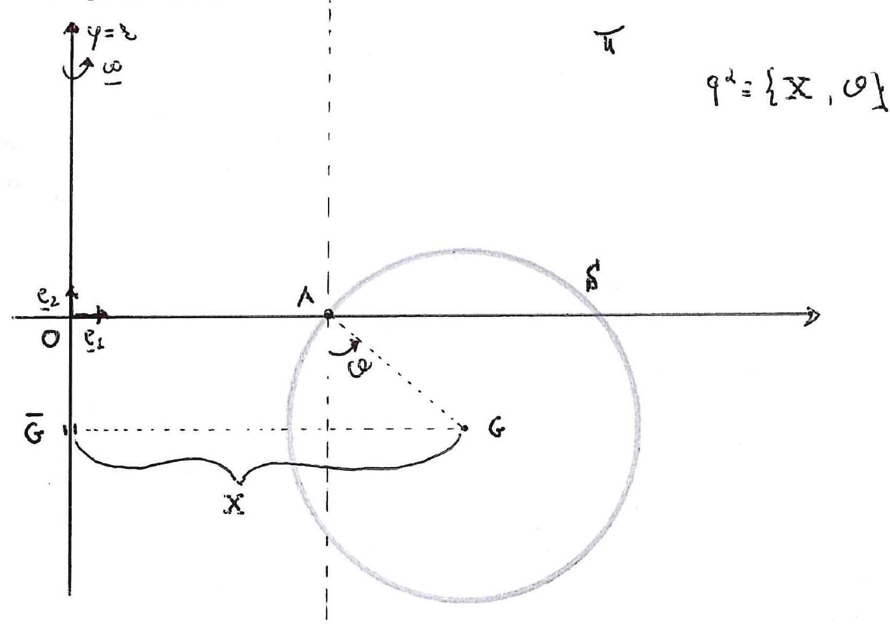

>Università degli studi di Catania  Corso di laurea Triennale in Matema tica Prova scritta di Fisica  Matematica Appello del 23.12.2021

---

Un piano verticale $\Pi$ ruota uniformemente, con velocitá angolare
$\vec{\omega}$ attorno ad una sua retta verticale $r$.

Tale piano coincide con il piano coordinato $x y$ di un riferimento
ortonormale levogiro
$\left\{O, \overrightarrow{e_{1}}, \overrightarrow{e_{2}}, \overrightarrow{e_{3}}\right\} \equiv\{O, x, y, z\}$
con l'asse delle $y$ verticale ascendente sovrapposto alla retta $r$
(vedi figura)

In $\Pi$ é mobile un disco $S$ omogeneo, di massa $m$, raggio $R$ e
centro $G$, avente un estremo $A$ di un suo diametro vincolato a
muoversi sull'asse delle $x$.

Scegliando come parametri lagrangiani le coordinate generali
$\{X, \vartheta\}$, dove $X$ l'ascissa del baricentro di $S$ e
$\vartheta$ l'angolo che il vettore $(G-A)$ forma con la verticale
discendente (vedi figura), e che su $S$, oltre alla forza peso, agiscano
le forze

$$\left\{F_{1}=-K(G-\bar{G}), G\right\} \quad \text { ed } \quad\left\{F \overrightarrow{e_{1}}, B\right\} \quad \text { con } \quad K>0, \quad F \geq 0$$

essendo $\bar{G}$ la proiezione ortogonale di $G$ sull'asse delle $y, B$
il punto del disco tale che $(B-G)=\overrightarrow{e_{3}} \wedge(A-G)$.

Nella ipotesi che i vincoli siano realizzati senza attrito, si chiede
di:

1.  Determinare sotto quali condizioni sui parametri non esistono
    configurazioni di equilibrio relativo per $S$.

2.  Escludendo il caso di cui al punto 1. determinare tutte le possibili
    configurazioni di equilibrio relativo di S, analizzando la stabilitá
    ed instabilitá solo nel caso $F \neq m g$ ed
    $m \omega^{2}-k \neq 0$.

3.  Scrivere le equazioni del moto relativo di $S$ e gli eventuali
    integrali primi

4.  Studiare ove possibile in maniera esatta o, almeno, qualitativamente
    il moto di $S$.

5.  Supposto che su $S$ agisca l'ulteriore forza
    $\{\widetilde{F}=-h \dot{G}, G\}$ (con $h>0$ ), dire come si
    modificano le configurazioni di equilibrio e la relativa stabilitá.

6.  Nell'ipotesi di cui al punto 5. scrivere le corrispondenti nuove
    equazioni di Lagrange studiando i moti in prima approssimazione
    (sempre nel caso in cui $F \neq m g$ ed $m \omega^{2}-k \neq 0$ )
    attorno ad una eventuale configurazione di equilibrio stabile.

---

??? note "Visualizza lo svolgimento"
    
    Non ancora disponibile. Se sei in possesso dello svolgimento, valuta la possibilità di contribuire al progetto facendo click sull'icona di modifica in alto a destra

---

[:fontawesome-regular-file-pdf: Download](pdf/2021-12-23.pdf){ .md-button }
