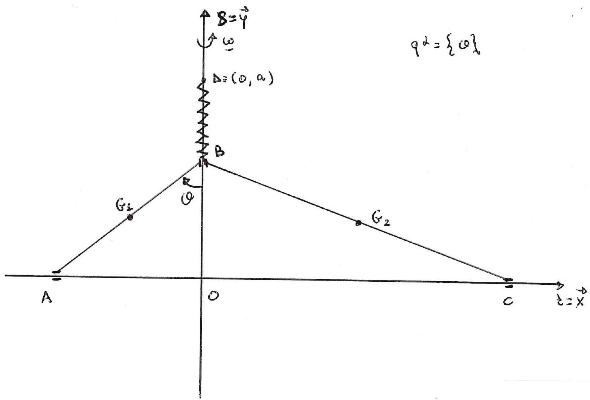

>Università degli studi di Catania  Corso di laurea Triennale in Matematica  Prova scritta di Fisica Matematica  Appello del 25.02.2022

---

Un sistema materiale é costituito da due aste omogenee pesanti
denominate rispettivamente $\overline{A B}$ di massa $M_{1}$ e lunghezza
$L_{1}$ e $\overline{B C}$ di massa $M_{2}$ e lunghezza $L_{2}$ con
$L_{2}>L_{1}$, incernierate senza attrito in $B$. Il sistema, posto in
un piano verticale $\Pi$, ha i punti $A$ e $C$ su una guida liscia
orizzontale $r$ (asse delle $\vec{x}$ in figura), mentre il punto $B$
scorre senza attrito su una guida verticale $s$ (asse delle $\vec{y}$ in
figura), con $O$ punto di intersezione tra $r$ ed $s$. Sul sistema oltre
alla forza peso agisce la forza elastica

$$\{F=-k(B-D), B\} \quad \text { con } \quad k>0$$

essendo $D=(0, a)$ un punto di $s$ posto superiormente ad $r$ con
$a>L_{1}$. Inoltre il piano verticale $\Pi$ ruota uniformemente, con
velocitá angolare $\vec{\omega}$ attorno alla retta verticale $s$.
Scegliendo come unica coordinata lagrangiana l'angolo $\vartheta$ tra la
verticale $s$ e l'asta $\overline{A B}$ (come in figura) si chiede di
determinare

1.  Tutte le possibili configurazioni di equilibrio del sistema.

2.  Ponendo per semplicitá $M_{1}+M_{2}=M$, studiare la
    stabilità-instabilità delle configurazioni di equilibrio sistema,
    assumendo che valga la condizione

$$\frac{2 k a-M g}{2 L_{1}\left(k+M \omega^{2} / 3\right)} \geq 1 .$$

3.  Scrivere l'equazione di moto, determinando gli eventuali integrali
    primi.

4.  Nelle condizioni del punto 2. studiare i moti in prima
    approssimazione attorno ad una configurazione di equilibrio stabile
    per il sistema.

---

??? note "Visualizza lo svolgimento"
    

---

[:fontawesome-regular-file-pdf: Download](pdf/2022-02-25.pdf){ .md-button }