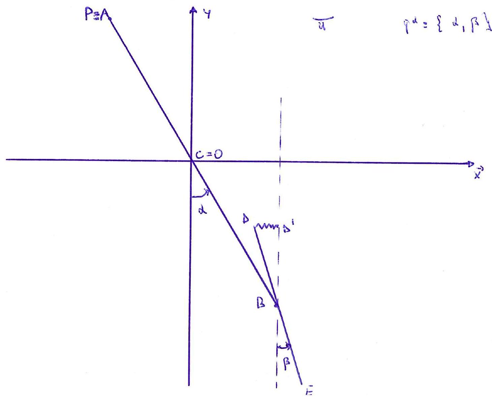

>Università degli studi di Catania  Corso di laurea triennale in Fisica  Esame di Meccanica Analitica  Appello del 15.04.2022

---
Un sistema materiale $S$, posto in un piano verticale $\Pi$, é
costituito da due aste pesanti denominate rispettivamente $A B$ e $D E$
e da un punto materiale $P$. $A B$ é un'asta omogenea di massa $M / 4$ e
lunghezza $4 d$ che ha il suo punto medio $C$ fisso, coincidente con
l'origine $O$ del riferimento $\{O, \vec{x}, \vec{y}\}$ rappresentato in
figura nel piano $\Pi$ (potendo quindi, l'asta $A B$, ruotare attorno al
punto fisso $O$ ). $D E$ é un'asta di massa $M$ e lunghezza $2 d$ con
densitá non omogenea $\varrho(s)=\gamma s^{2}$ (essendo $s$ la distanza
di un generico punto dell'asta valutata a partire dal suo estremo $D$ )
con $\gamma>0$ ed $0 \leq s \leq 2 d$. L'asta $D E$ ha il suo punto
medio incerneriato con l'estremo $B$ dell'asta $A B$ (potendo quindi,
l'asta $D E$, ruotare attorno a tale punto). Infine il punto $P$ di
massa $2 / 3 M$ è fissato sull'estremo $A$ dell'asta $A B$. Sul sistema
oltre alla forza peso agisce la forza elastica

$$\left\{F=-k\left(D-D^{\prime}\right), D\right\} \quad \text { con } \quad k>0$$

essendo $D^{\prime}$ la proiezione di $D$ sulla retta verticale passante
per $B$. Scegliendo come coordinate lagrangiane gli angoli
$\{\alpha, \beta\}$ che le aste $A B$ e $D E$ formano rispettivamente
con le verticali discendenti passanti per i punti medi $C$ e $B$ delle
stesse (vedi figura) si chiede di:

1.  Determinare tutte le possibili configurazioni di equilibrio del
    sistema studiando la stabilità-instabilità, delle suddette
    configurazioni, solo nel caso in cui valga la condizione
    $M g \neq 2 k d$.

2.  Scrivere le equazioni di moto, determinando gli eventuali integrali
    primi.

3.  Studiare i moti in prima approssimazione attorno alla evidente
    configurazione di equilibrio $\{\alpha=0, \beta=0\}$.

4.  Determinare dei possibili moti per i quali: l'asta $D E$ si mantiene
    verticale $(\sin (\beta)=0)$, avendosi atto di moto nullo iniziale
    per l'asta $A B\left(\dot{\alpha}_{0}=0\right)$.

5.  Supponendo, infine che, a differenza dei punti precedenti, il piano
    $\Pi$ ruoti uniformemente, con velocitá angolare $\omega$ attorno
    all'asse $\vec{y}$, calcolare il potenziale centrifugo associato
    all'intero sistema $S$.

---

??? note "Visualizza lo svolgimento"
    
    Non ancora disponibile. Se sei in possesso dello svolgimento, valuta la possibilità di contribuire al progetto facendo click sull'icona di modifica in alto a destra

---

[:fontawesome-regular-file-pdf: Download](pdf/2022-04-15.pdf){ .md-button }