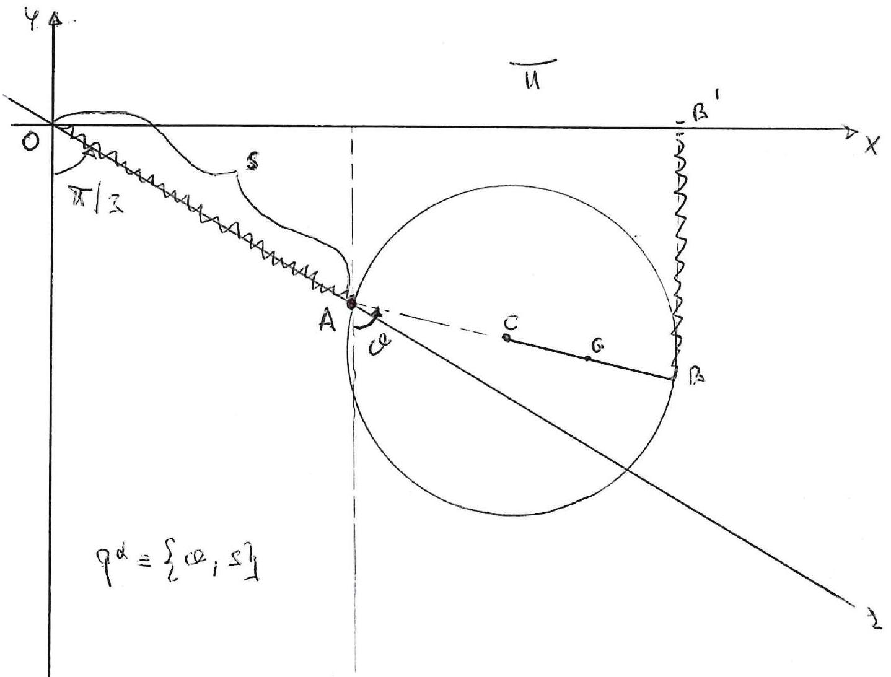

>Università degli studi di Catania  Corso di laurea Triennale in Matematica  Prova scritta di Fisica Matematica  Appello del 24.06.2022

---
Un sistema materiale $S$, posto in un piano verticale $\Pi$, é
costituito da una circonferenza $\gamma$ omogenea di raggio $R$, centro
$C$ e massa $3 m$, e da un'asta omogenea $C B$ di lunghezza $R$ e massa
$m$ saldata a $\gamma$ in un suo punto $B$. Sul punto di $\gamma$
diametralmente opposto a $B$ é saldato un pattino $A$ attorno a cui
$\gamma$ puó ruotare mantenendosi nel piano verticale $\Pi$.
Nell'ipotesi che $A$ scorra su una guida $r$ di $\Pi$ inclinata di
$\pi / 3$ rispetto alla verticale discendente, che tutti i vincoli siano
lisci, e che sul sistema agiscano anche le forze

$$\left\{F_{1}=-\frac{2 m g}{R}\left(B-B^{\prime}\right), B\right\} \quad \text { e } \quad\left\{F_{2}=-\frac{m g}{R}(A-O), A\right\}$$

essendo $O$ un punto di $r$ e $B^{\prime}$ la proiezione ortogonale di
$B$ sull'orizontale per $O$ (asse $\vec{x}$ ). Scegliendo come
coordinate lagrangiane l'angolo $\vartheta$ che $A B$ forma con la
verticale discendente passante per $A$, ed $s$ la distanza del punto $A$
dal punto $O$ sulla guida $r$ (vedi figura) si chiede di:

1.  Determinare tutte le possibili configurazioni di equilibrio del
    sistema studiando la stabilità-instabilità, delle suddette
    configurazioni.

2.  Scrivere le equazioni di moto, determinando gli eventuali integrali
    primi.

3.  Studiare i moti in prima approssimazione attorno alla configurazione
    di equilibrio nella quale $O \equiv A$ e $B$ é sulla verticale
    discendente per $O$.

4.  Supponendo, infine che, a differenza dei punti precedenti, il piano
    $\Pi$ ruoti uniformemente, con velocitá angolare $\omega$ attorno
    all'asse $\vec{y}$, calcolare il potenziale delle forze apparenti
    associato all'intero sistema $S$.

---

??? note "Visualizza lo svolgimento"
    

---

[:fontawesome-regular-file-pdf: Download](pdf/2022-06-24.pdf){ .md-button }