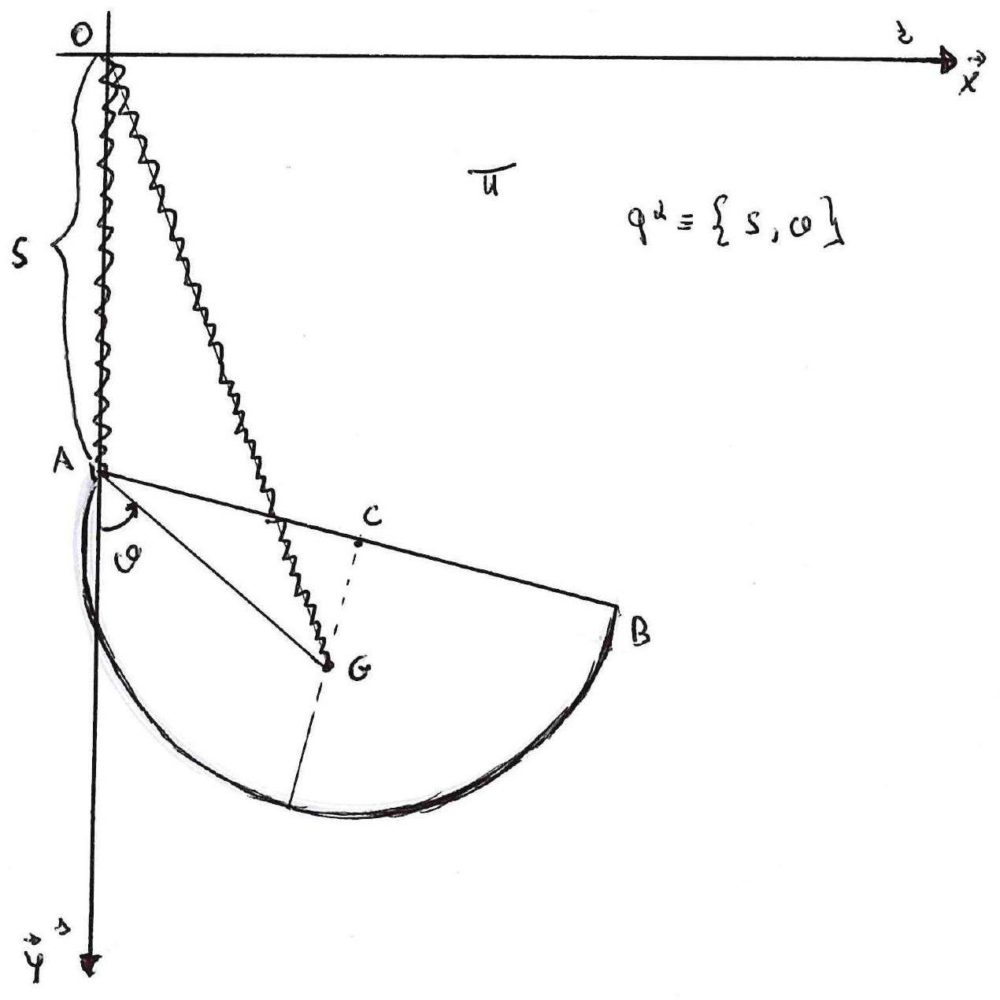

>Università degli studi di Catania  Corso di laurea Triennale in Fisica  Prova scritta di Meccanica Analitica  Appello del 22.07.2022

---

Sia dato un sistema mobile in un piano verticale liscio $\Pi$,
costituito da un semidisco omogeneo $\Gamma$ di centro $C$, raggio $R$,
base $A B$, massa $M$ e baricentro $G$. L'estremo $A$ della base é
vincolato a muoversi su una guida rettilinea verticale $s$ di $\Pi$
(asse $\vec{y}$ in figura). Sia $r$ una retta orizontale di $\Pi$ (asse
$\vec{x}$ in figura) e sia $O$ il punto di intersezione fra le rette $r$
ed $s$. Utilizzando $\{O, \vec{x}, \vec{y}\}$ come sistema di
riferimento riportato in figura, e $\{S, \vartheta\}$ come variabili
lagrangiane, essendo $S$ l'ordinata di $A$ e $\vartheta$ l'angolo che il
segmento $G A=d$ forma con l'asse verticale discendente passante per
$A$. Sul disco $\Gamma$, oltre alla forza peso agiscono le due forze
elastiche

$$\left\{F_{1}=-h(A-O), A\right\}, \quad\left\{F_{2}=-k(G-O), \quad \text { con } \quad h>0, \quad \text { e } \quad k>0\right.$$

Supponendo che tutti i vincoli siano realizzati senza attrito, si chiede
di determinare:

1.  Tutte le possibili configurazioni di equilibrio e, discuterne la
    stabilitá e/o instabilitá con la condizione $k^{2} d-m g h \neq 0$

2.  Scrivere le equazioni del moto, e gli eventuali integrali primi

3.  discutere il moto linearizzato attorno alla evidente configurazione
    di equilibrio per la quale il baricentro $G$ si trova superiormente
    ad $A$ sulla retta $s($ asse $\vec{y})$

4.  Supposto di aver fissato $A$ coincidente con $O$ studiare il moto
    del semidisco quando esso abbia inizio, con atto di moto nullo,
    dalla configurazione per la quale il baricentro $G$ si trovi
    sull'orizontale positiva (semiasse $\vec{x}$ positivo) per $O$.

---

??? note "Visualizza lo svolgimento"
    
    Non ancora disponibile. Se sei in possesso dello svolgimento, valuta la possibilità di contribuire al progetto facendo click sull'icona di modifica in alto a destra

---

[:fontawesome-regular-file-pdf: Download](pdf/2022-07-22.pdf){ .md-button }