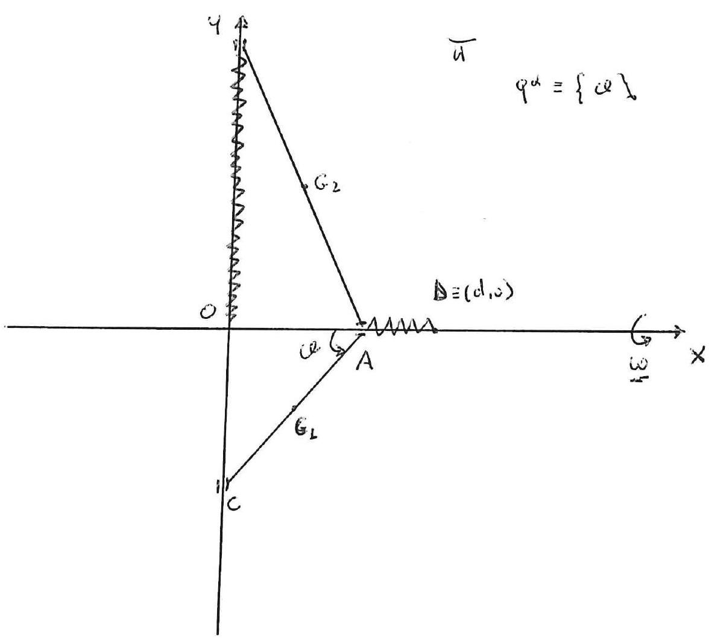

>Università degli studi di Catania  Corso di laurea triennale in Fisica  Esame di Meccanica Analitica  Appello del 10.02.2023

---

In un piano $\Pi$ si consideri un riferimento $\{O, x, y\}$, ed in
questo piano sia dato un sistema materiale $S$ costituito da da due aste
omogenee denominate rispettivamente $A C$ di massa $m_{1}$ e lunghezza
$l_{1}$ e $A B$ di massa $m_{2}$ e lunghezza $l_{2}$ con $l_{2}>l_{1}$,
incernierate senza attrito in $A$. Gli estremi $B$ e $C$ delle due aste
possono scorrere senza attrito sulla verticale $\vec{y}$ di $\Pi$ (vedi
figura), mentre il punto $A$ scorre senza attrito sull'asse $\vec{x}$
del riferimento (vedi figura). Sul sistema $S$ agiscano solo le due
forze elastiche

$$\left\{F_{1}=-k(A-D), A\right\} \quad\left\{F_{2}=-k(B-O), B\right\} \quad \text { con } \quad k>0$$

essendo $D=(d, 0)$ un punto fissato sull'asse $\vec{x}$ positivo.
Inoltre il piano verticale $\Pi$, contenente il sistema $S$, ruota con
velocitá angolare uniforme $\vec{\omega}$ attorno all'asse $\vec{x}$.

Scegliendo come unica coordinata lagrangiana l'angolo $\vartheta$ tra la
distanza $O A$ e l'asta $A C$ (come in figura) si chiede di determinare,
nel riferimento relativo

1.  Tutte le possibili configurazioni di equilibrio del sistema,
    studiandone la la stabilitá-instabilitá.

2.  Scrivere l'equazione di moto, determinando gli eventuali integrali
    primi.

3.  Studiare i moti in prima approssimazione attorno alle configurazioni
    di equilibrio per il sistema.

---

??? note "Visualizza lo svolgimento"
    
    Non ancora disponibile. Se sei in possesso dello svolgimento, valuta la possibilità di contribuire al progetto facendo click sull'icona di modifica in alto a destra

---

[:fontawesome-regular-file-pdf: Download](pdf/2023-02-10.pdf){ .md-button }